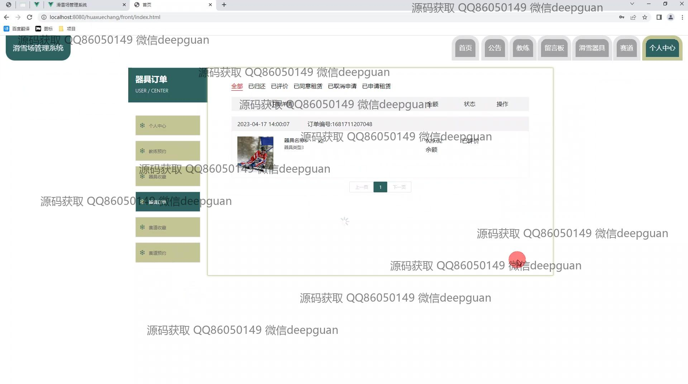

<h1 align="center">滑雪场管理系统</h1>

## 简介
滑雪场管理系统：角色分为管理员、用户；主要功能包括用户注册、赛道预约、用户充值、设备管理、教练预约、订单管理和统计报表，提升滑雪场管理效率和用户体验。    --计算机毕业设计源码；毕设源码；java毕业设计源码

## 联系方式

<h3 align="center">获取完整代码与数据库文件 + 微信：deepguan QQ: 86050149 QQ群: 783742310</h3>

<h3 align="center">可帮忙远程部署 包运行成功！提供远程部署、修改代码、设计文档指导、代码讲解等服务！</h3>

## 功能介绍（完整见运行截图）
用户：用户可以在注册和登录后访问个人中心，管理个人信息，进行账户充值和密码修改。可以通过菜单导航进行滑雪器具浏览、租赁订单查看、教练预约和赛道预约等操作。用户可以使用过滤和搜索功能快速查找预约记录和订单详情。界面提供了便捷的操作按钮，实现预约的提交、修改或删除。

管理员：管理员通过后台管理界面进行系统的全面管理，包括用户管理、教练管理、滑雪器具管理、赛道管理和公告管理。可通过搜索和筛选功能快速进行信息查询和调整，监控和优化滑雪场的运营情况。统计报表界面允许查看数据趋势，以支持决策。管理员可以处理用户的反馈，提升整体服务质量和效率。

## 运行截图

本代码来源于网络,仅供学习参考使用!

